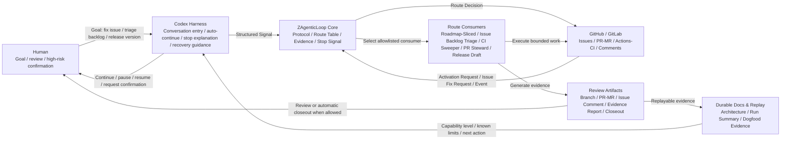
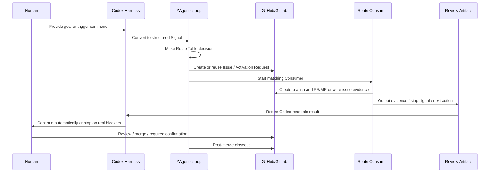
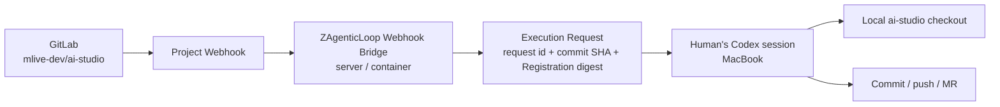
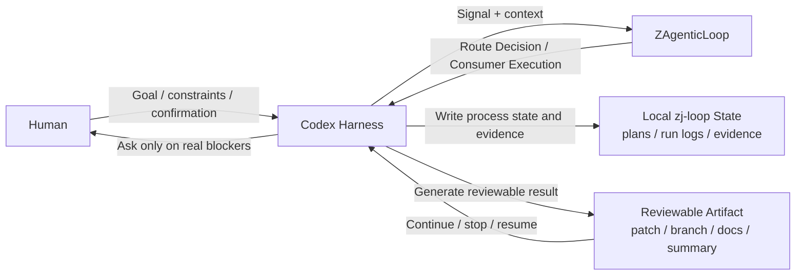

# Codex Harness + ZAgenticLoop Centered Product Solution

## Purpose

This document captures the product solution where Codex Harness becomes the first complete ZAgenticLoop experience path.

The goal is not to create a Codex-only parallel protocol. The goal is to wrap the existing ZAgenticLoop primitives into a smoother product experience:

1. Human gives a goal or signal.
2. Codex Harness turns it into structured loop input.
3. ZAgenticLoop routes, executes, verifies, and records evidence.
4. GitHub/GitLab or local Codex-centered artifacts carry reviewable outcomes.
5. The loop continues automatically when safe, bounded, authorized, and verifiable.
6. The loop stops only on real stop signals.

## Product Architecture



## First Complete Experience Path



This provider-backed path is the strongest product path when the user project already uses GitHub or GitLab for issues, merge requests, CI, review, and closeout.

## GitLab Bridge With a Local Codex Session

The first practical Agent Executor for a provider-backed project may be a
Human-in-the-loop Codex session on a developer workstation. The current Codex
Desktop conversation is not assumed to be a remotely addressable Agent API.
The bridge therefore emits a durable execution request, and the Human's Codex
session claims and executes it locally.

For example, a bridge running on the `ai-studio-gitlab` deployment carrier can
receive a webhook for `mlive-dev/ai-studio`, while the Human uses a local
checkout on a MacBook:



The initial B1 loop is:

1. GitLab emits the event and the bridge validates the project, route, and
   Registration.
2. The bridge creates a replayable execution request with the immutable
   Registration binding.
3. The Human's Codex session reads and claims the request.
4. Codex works in the local `ai-studio` workspace, then commits, pushes, and
   produces the route's review artifact.
5. Subsequent verification and closeout consume the resulting evidence.

This is intentionally different from remotely spawning `codex` or `claude` from
the bridge. A later B2 implementation may add a Mac Agent Worker and Dispatcher
that use an outbound connection or polling, but that worker is a separate
registered executor with its own workspace, permissions, timeout, and
completion contract.

The B1 request contract is opt-in and does not repeat executor policy:

```text
/zj-loop start roadmap-sliced-development

<!-- zj-loop.agent_execution_request.v1
{
  "request_id": "req-123",
  "registration": {
    "ref": "<commit-sha>",
    "path": "zj-loop/registrations/reg-123.yaml",
    "sha256": "<digest>"
  }
}
-->
```

The executor is read only from the digest-verified Registration. The project
default Registration remains the fallback for a plain marker, and the project
allowlist remains the capability ceiling. The Human Codex claim is the explicit
activation gate for `agent-local`.

The completion artifact is committed to the execution branch at:

```text
zj-loop/evidence/agent-execution/<request-id>/result.json
```

The Draft MR is the review entry point. A completion or blocked Note may be
added to the source Issue for Human visibility, but the committed evidence
artifact is the authoritative result. A request Note is immutable after bridge
acceptance; a changed executor or Registration requires a new Note and
`request_id`.

## Codex-Centered No-Provider Path

ZAgenticLoop should also support a product path that does not depend on GitHub or GitLab.



The Codex-centered path is useful for local projects, early drafts, private environments, and teams that have not connected an issue tracker or PR provider yet.

## Experience Path Options

| Path | Center | External provider | Best for | Review artifact |
| --- | --- | --- | --- | --- |
| Provider-backed path | Codex Harness + ZAgenticLoop + GitHub/GitLab | Required | Teams using issues, PR/MR, CI, and platform review | Issue, PR/MR, CI evidence, closeout comment |
| Codex-centered path | Codex Harness + ZAgenticLoop | Optional / none | Local projects, private work, early design, no issue tracker | Patch, branch, docs, local evidence, Codex summary |

Both paths should use the same ZAgenticLoop concepts where possible:

- Signal
- Route Decision
- Activation Request or local equivalent
- Consumer execution
- Evidence
- Stop Signal
- Reviewable Artifact
- Closeout

The implementation may differ by provider, but the protocol language should stay aligned so fixes and lessons from one path can improve the other.

## Product Boundary

Codex Harness is an experience orchestration layer. It should not replace these ZAgenticLoop components:

- Route Table
- Activation Request
- Consumer Runner
- Evidence protocol
- Stop Signal protocol
- Provider adapters

Codex Harness should make those components easier to use by handling:

- conversational entry points;
- structured signal creation;
- automatic continuation when conditions are safe;
- clear stop explanations;
- recovery and resume guidance;
- readable next actions;
- evidence summarization for humans.

## Design Principle

The product should default toward an automated loop. Preconditions, permissions, budgets, verification failures, and high-risk actions should become structured stop signals.

The user experience should not start from a pile of confirmation gates. It should start from a useful goal and keep moving until there is a real reason to stop.
