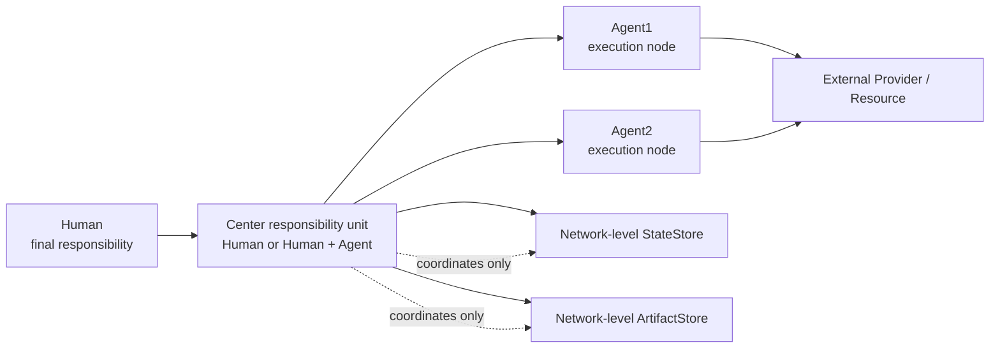
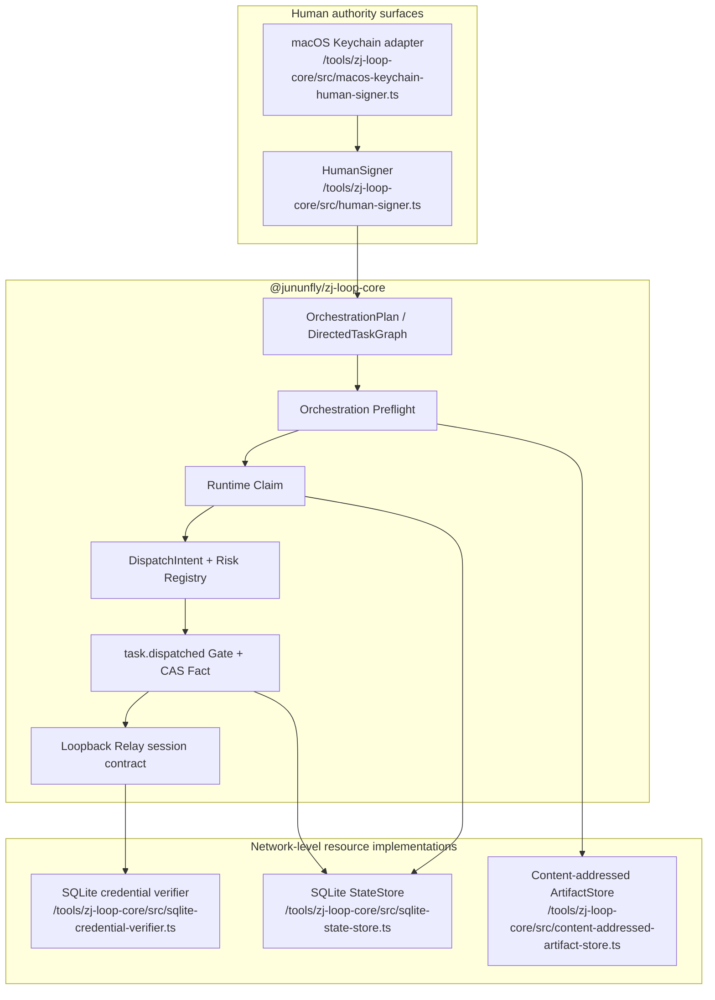
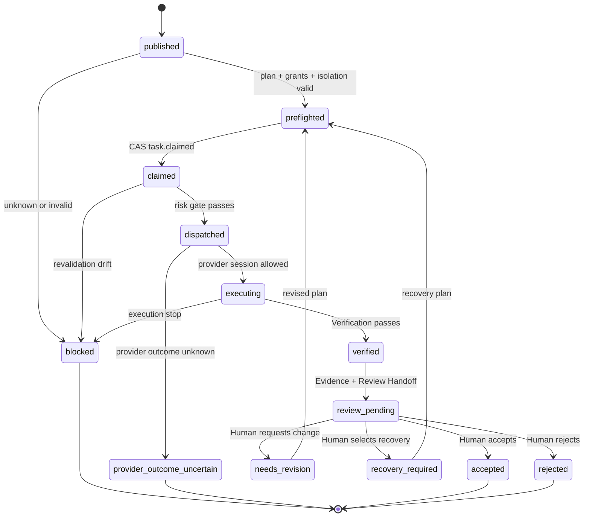
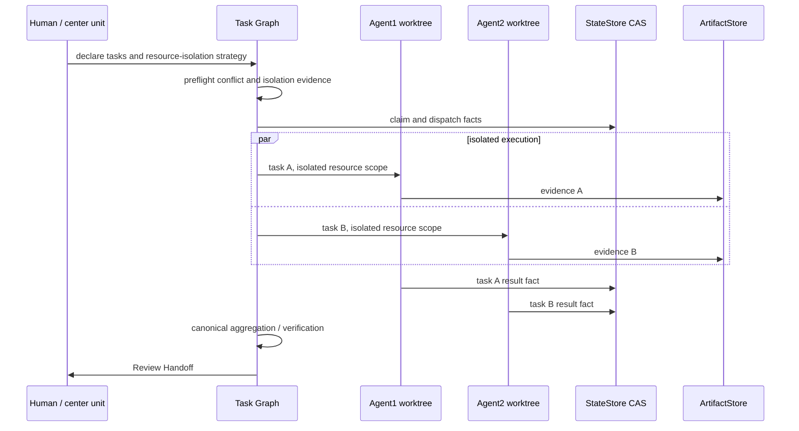

# OPN Architecture State Overview

Status: architecture baseline locked on 2026-07-31.

This document is the durable architecture view of the OPN product model. It
describes the current implementation boundary, not a promise that every
future protocol surface already exists.

## 4C Views

The project uses four complementary views: **Context**, **Composition**,
**Contract**, and **Concurrency**. They are four views of one system, not four
independent architectures.

### C1: Context and Responsibility

The center has coordination authority, not automatic ownership of network
storage or every node's private resources. Agent1 and Agent2 are abstract
placeholders; concrete agents are adapter instances.

### C2: Composition and Runtime Locations

Current code implements typed contracts, deterministic validators, SQLite
reference stores, a loopback Relay, and the dispatch boundary. Provider
adapters beyond the reference Relay are not implied by this diagram.

### C3: Contract and Protocol Lifecycle

State transitions are appended as facts. A result is not complete until the
Human decision path reaches `accepted`.

### C4: Concurrency and Storage Isolation

ZAgenticLoop checks that the center has a known, verifiable isolation plan.
It does not implement a universal lock for Git, filesystems, or arbitrary
external resources. A Git example is separate worktrees or branches followed
by center-controlled merge and aggregate verification.

## Data and Authority Boundaries

| Object | Logical owner | Current location | Role |
| --- | --- | --- | --- |
| `OrchestrationPlan` | Center responsibility unit | Artifact/plan input and typed core contract | Versioned intended graph |
| Lifecycle facts | Network-level StateStore | SQLite reference implementation | Append-only facts and CAS projections |
| Evidence | Event-scoped network resource | Content-addressed ArtifactStore | Full reports, digests, and replay material |
| Human signature | Human authority surface | In-memory fixture or platform signer | Binds Human approval to canonical payload |
| Provider session | Provider adapter | Loopback Relay reference implementation | Bounded, idempotent dispatch session |

Center coordination does not automatically grant read/write access to every
row, artifact, or provider resource. Access remains identity-, capability-,
scope-, expiry-, and audit-bound.

## Implemented Boundary

Implemented and tested in `@jununfly/zj-loop-core`:

- `OrchestrationPlan` and `DirectedTaskGraph` typed validation
- immutable resource-isolation descriptors and profile digest
- P-256 signed orchestration approval envelope
- pure orchestration preflight and persistence boundary
- SQLite-backed runtime claim and CAS facts
- provider-neutral `DispatchIntent` and deterministic validator
- immutable Capability/Risk Registry with fail-closed unknown capabilities
- `task.dispatched` risk gate and idempotent CAS fact recording
- Relay session binding with `session_request_id` idempotency and conflict detection
- HumanSigner provider-neutral contract and memory fixture
- SQLite StateStore, content-addressed ArtifactStore, and loopback Relay reference pieces

The latest implementation verification is recorded by the repository test
suite and the roadmap `1-4-1` through `1-4-5` evidence.

## Not Yet Implemented Boundary

The following remain outside the completed boundary:

- complete Human Grill, blocked/recovery, and re-preflight user path
- a real two-agent Native OPN Tracer using abstract Agent1/Agent2 roles
- independent semantic review and complete Review Handoff conformance gate
- final Graph Engineering Evidence Set and end-to-end conformance acceptance
- general-purpose external Provider adapters beyond the reference Relay
- cross-device discovery, transport, and multi-device production hardening
- Extension adapters for external workflow frameworks

These are next-milestone candidates, not implicit promises of the current
baseline.

## Architectural Invariants

1. Human or Human+Agent is the center responsibility unit.
2. Agent1, Agent2, and other agents are explicitly granted execution nodes.
3. Enrollment, event participation, capability grant, and task claim are separate.
4. Authority delegation is monotonic and cannot cross the Human grant ceiling.
5. Unknown isolation, permission, risk, cost, validation, or provider outcomes stop the path.
6. Only `dispatched` permits the corresponding external side effect.
7. Plan, fact, projection, and artifact are separate layers.
8. StateStore and ArtifactStore are network-level logical resources.
9. Review Handoff separates execution output from Human final acceptance.
10. Scale is allowed only after composition invariants are proven.
