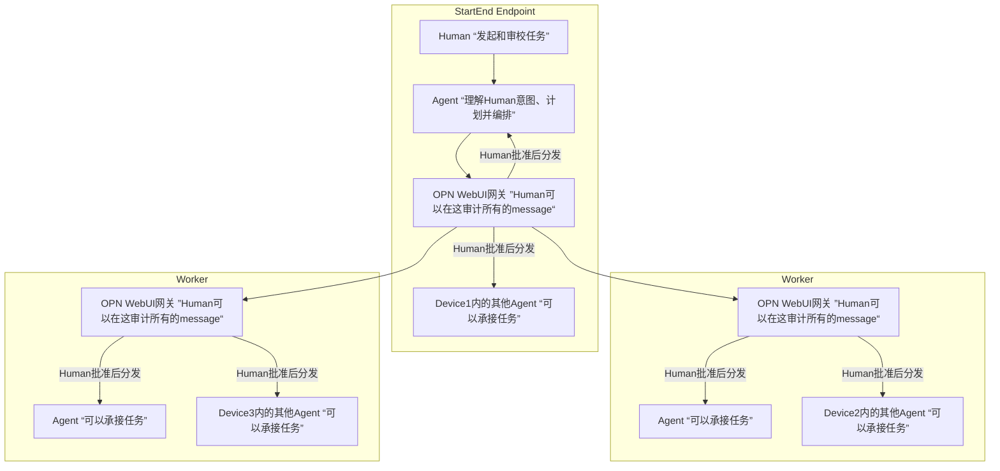

# OPN Human-Audited Task Routing Topology

This topology shows the intended OPN collaboration model:

- The StartEnd Endpoint contains the Human who initiates and reviews work, the planning/orchestration Agent, the local OPN WebUI gateway, and other local Agents.
- Each Worker device has its own OPN WebUI gateway. The gateway is the local audit boundary for messages entering and leaving that device.
- A Human approval at the relevant gateway is the distribution gate. An Agent may only execute a task after the gateway has admitted it.
- A Worker Agent returns its result through OPN to the originating endpoint, where the result remains available for audit and follow-up.

