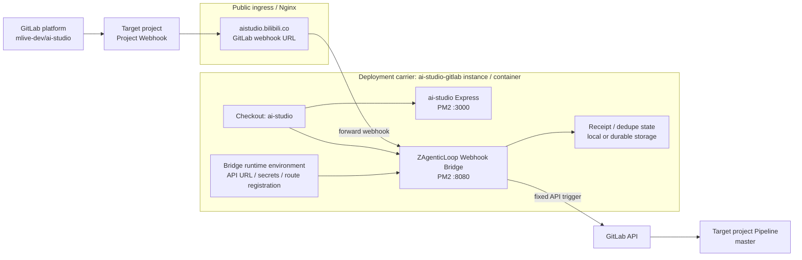

# Route Consumer Execution Architecture

This document is the durable architecture reference for Route consumer
execution in ZAgenticLoop. It defines how a Route consumer moves from report
evidence to bounded execution without letting protocol evidence masquerade as
live capability.

`docs/designs/route-table-architecture.md` defines the routing control plane.
This document defines execution readiness and completion boundaries for the
consumers behind those routes.

## Goal

Every action-capable Route consumer should eventually execute to its own
bounded completion form, while report-only consumers remain visibly report-only.
This execution goal follows the architecture-and-experience alignment principle
in [ZAgenticLoop Architecture](./architecture.md): route capability is complete
only when deterministic execution evidence and the user-facing loop experience
advance together. The system must make partial readiness obvious:

- a route can be enabled without being live
- a protocol can be replayed without having a runner
- a request can be claimable without starting repair
- a live runner must carry recent successful evidence

Whenever a route advances in protocol maturity, runner maturity, execution
mode, or provider support, the corresponding user experience must also be
checked: can a user or automation move from signal to request carrier, consumer
run, verification evidence, and review artifact or structured hard stop without
guessing where to reply, which command to run next, or which evidence is the
current source of truth?

## GitLab Bridge Deployment Topology

The GitLab bridge may run on a separate container, server, or workstation from
the target GitLab project. A test instance can therefore host both a product
checkout and the bridge process without becoming the target project itself.

For the current `mlive-dev/ai-studio` integration, the `ai-studio-gitlab`
instance is the deployment carrier: its main Express application may listen on
port `3000`, while the independent bridge process listens on port `8080`. The
GitLab Project Webhook belongs to `mlive-dev/ai-studio`; it does not belong to
the deployment carrier's name.



The bridge is an ingress and dispatch boundary. It must not infer the target
project from the deployment carrier name, and it must not treat the carrier's
current checkout branch as request identity.

## Project Registration and Executor Binding

The canonical Route Protocol is global, while a project Registration supplies
the project's default executor and its allowlisted executor profiles. The
Registration is versioned in the target repository rather than hidden in
bridge environment variables:

```text
master/zj-loop/registrations/project.yaml
branch-or-commit/zj-loop/registrations/<registration-id>.yaml
```

The project default becomes active only after its `master` commit is merged.
A local Registration may be unmerged but must already be pushed and addressed
by an immutable commit SHA and file digest. A request may opt into it only with
an explicit, validated contract. Ordinary markers use the project default.

Registration precedence is therefore:

```text
global Route Protocol
  -> project default Registration
    -> explicit commit-pinned local Registration
      -> execution envelope snapshot
```

The project Registration defines the capability ceiling. A local Registration
may select only an allowlisted `executor kind + profile + capabilities` tuple;
it cannot add a workspace, command, token, or provider write scope. The
executor binding is copied into the envelope and never re-read during an
active execution.

The initial `mlive-dev/ai-studio` profiles are:

```text
gitlab-pipeline / ai-studio-master-pipeline   (default)
agent-local    / human-codex-mac              (explicit contract + Human claim)
```

The branch is workflow context, not Registration identity. Registration
identity is `commit SHA + path + SHA-256 digest`.

## Durable State and Reconciliation

When deployment storage is reset on instance publication, bridge state must
not depend on the local checkout. The temporary durable substrate is a
protected `zj-loop-state` branch in the target GitLab repository:

```text
zj-loop-state/receipts/<event-id>.json
zj-loop-state/dedupe/<dedupe-key>.json
zj-loop-state/executions/<request-id>/*.json
```

The state branch is append-only. A dedicated state-writer credential can write
only this branch and path family; it is distinct from the bridge Pipeline
trigger token. State commits use `[skip ci]` and the project CI workflow skips
the state branch so evidence writes cannot create a feedback pipeline.

The Webhook request returns after the API Pipeline is created. A separate
reconciler reads the Pipeline and its artifacts, validates the event/project/
route/Registration binding, and appends final evidence to `zj-loop-state`.
Network ambiguity is `trigger-uncertain`; it never causes an automatic provider
retry.

## A/B Execution Envelope

A and B share `zj-loop.execution_envelope.v1`. The envelope records the source
identity, Registration snapshot, executor binding, and side-effect state. A
Pipeline or Agent Executor adds only executor-specific fields. Unknown protocol
versions or mismatched digests fail closed.

For A, the default `roadmap-sliced-development` marker triggers only the
`master` API Pipeline. The first consumer is report/plan-only and must upload
structured artifacts with `allow_failure: false`; it does not receive
`GITLAB_TOKEN`, create a branch, create an MR, or modify business files.

For B1, an explicit hidden JSON request contract selects a local Registration.
The Human's Mac Codex session claims it, creates an independent worktree from
the Registration commit, and completes with a commit, verification evidence,
and Draft MR. The current Codex Desktop session is Human-in-the-loop, not a
remotely addressable Agent API.

## Control Surfaces

`zj-loop/zj-loop-route-table.yaml` is the project-specific source of truth for
execution state. It owns:

- route enablement
- consumer kind
- execution mode
- side effect level
- protocol and runner maturity
- light consumer capabilities
- recent evidence pointers

`patterns/registry.yaml` does not carry execution state. It remains a product
catalog for pattern discovery and capability declaration.

## Consumer Kinds

Consumer kind is mandatory because it constrains what a route is allowed to do.

| Kind | Role | Allowed completion boundary |
| --- | --- | --- |
| `producer-router` | Produces route evidence or dispatch candidates. | Report evidence only. |
| `report-consumer` | Records observations without starting work. | Report evidence only. |
| `human-gate` | Hands high or unknown risk to a human. | Human decision evidence. |
| `fix-runner` | Consumes Issue Fix Requests. | Repair PR or escalation issue. |
| `draft-consumer` | Produces reviewable drafts. | Draft PR, draft evidence, or escalation issue. |
| `cleanup-consumer` | Performs narrow post-merge cleanup. | Cleanup done, cleanup skipped, or escalation issue. |
| `activation-consumer` | Consumes activation requests and bootstraps a bounded roadmap lifecycle. | Roadmap branch/PR, activation failed, or activation resumable. |
| `triage-action-consumer` | Performs bounded issue triage side effects. | Triage label applied, triage comment posted, action skipped, or escalation issue. |

Daily Triage is a producer/router. It may update operational memory and create
or dispatch bounded requests through allowlisted routes, but it must not repair
code, bump dependencies, draft releases, mutate issues directly, or implement
roadmap slices.

Issue Backlog Triage routes remain report-only. Bounded side effects belong to
the separate `issue-triage-action` consumer and require their own Route Table
row, allowlist, runner evidence, and live promotion.

## Execution Modes

`execution.mode` is a fixed enum:

| Mode | Meaning |
| --- | --- |
| `report-only` | Records evidence or recommendations. No request consumption or work execution. |
| `request-only` | May create a durable request carrier, but does not claim or execute it. |
| `claim-only` | May consume a matching request and record claim evidence, but does not perform the work. |
| `dry-run` | Computes and records an execution plan without destructive or final side effects. |
| `live` | Performs bounded side effects permitted by consumer kind, capabilities, and route guards. |

`zj-loop-route enable` only makes a route visible and eligible for dispatch
consideration. It does not authorize live side effects.

Consumer plans should expose dispatch and execution readiness separately:

- `dispatch_allowed` answers whether Route Decision matched and may hand the
  signal to the route's consumer boundary.
- `execution_allowed` answers whether the consumer is currently allowed to run
  bounded side effects.
- Legacy `allowed` may remain as a compatibility field, but new evidence should
  avoid using one boolean to mean both dispatch and execution.

Report-only routes may be dispatch-allowed while execution remains false.
Blocked action routes should still point to their primary dry-run JSON artifact
so users can inspect why execution did not continue.

`zj-loop-route status --json` exposes the same split under
`automation_model`:

- `automation_model.readiness` contains the route readiness level and the
  derived `install_ready`, `execution_ready`, and `user_project_ready` booleans.
- `automation_model.authorization` contains `route_enabled`,
  `dispatch_allowed`, `execution_allowed`, any required fixed confirmation
  phrase, and blocked reasons.

This is intentionally redundant with the legacy top-level readiness booleans so
agents and scripts can consume one object without treating `enabled` as
execution permission.

Runner maturity promotion is deterministic and separate from route enablement:

```bash
zj-loop-route promote <route-or-consumer> --runner install-ready
zj-loop-route promote <route-or-consumer> --runner execution-ready --confirm "promote <consumer> runner to execution-ready"
```

Promotion updates `maturity.runner`; it does not enable the route and does not
run the consumer. Route enablement still uses `zj-loop-route enable`, and
side-effecting routes still require their own fixed confirmation phrase.

## Structured Dispatch

`zj-loop-dispatch` is the structured Signal orchestration entry. It is separate
from `zj-loop-run`:

- `zj-loop-run` accepts a user goal and resolves candidate routes for a Codex or
  local harness experience.
- `zj-loop-dispatch` accepts only a `zj-loop.signal.v1` JSON envelope and runs
  deterministic orchestration through the Route Table.

The dispatch path writes a replayable envelope to
`zj-loop/orchestrations/<orchestration_id>.json`. The envelope contains the
input signal, route decision, source-carrier plan, consumer run plan, review
artifact, closeout hint, stop signal, and duplicate key.

Dispatch status is fixed:

- `planned`: orchestration was produced without running a side-effecting
  consumer.
- `executed_to_review_artifact`: the route was execution-authorized and the
  orchestration reached the first review artifact boundary.
- `hard_stopped`: route/runtime gates blocked execution with structured next
  steps.
- `duplicate`: the same signal/route duplicate key already has an orchestration.
- `resume`: an existing orchestration was explicitly resumed.
- `superseded`: a later signal version replaces the previous orchestration.

Source issues, PRs, and MRs are reusable carriers by default. Dispatch should
append structured request comments to the source carrier unless the signal has
no tracker carrier or the target route explicitly requires an independent
carrier.

## Runtime Preflight Gate

`zj-loop-run` and `zj-loop-dispatch` must run a shared Runtime Preflight Gate
before a consumer runner executes. Preflight is a core package API with an
independent replay CLI:

```bash
zj-loop-preflight --route <route-id> --execution-layer report-only|review-artifact|live-side-effect --signal signal.json --json
```

The output schema is `zj-loop.preflight_result.v1`. It is persisted into
`zj-loop-run` machine envelopes and `zj-loop-dispatch` orchestration envelopes
as `preflight_result`, with a low-cost `runtime-preflight` evidence index.

Preflight has three statuses:

- `pass`: execution may continue.
- `warn`: execution may continue, but the warning is recorded in evidence.
- `hard_stop`: execution stops before the consumer runner and emits a
  structured stop signal.

Preflight facts come from three places:

- Route Table guards and execution declarations
- the Signal or Run envelope
- runtime facts such as actor role, credentials, work-unit request, dirty
  workspace paths, and existing loop state

Report-only and review-artifact paths are fail-open for incomplete optional
preflight fields: missing `max_work_units` defaults to `30` and records
`repairs_applied`. Live side effects are fail-closed when critical declarations
or runtime facts are missing, including provider credentials, actor role,
target branch safety, destructive cleanup, publish/release/tag actions, or
dirty workspace overlap.

Consumer/provider adapters remain the final defense for domain-specific
failures, but they should not be the first place to discover missing runtime
authority. Preflight handles generic runtime eligibility; consumers handle
domain correctness.

## Replay Evidence And Doctor

Runtime replay uses a deterministic derived view, not a new truth file. The raw
facts remain:

- `zj-loop/runs/*.json` for `zj-loop-run` and Codex Harness goal runs
- `zj-loop/orchestrations/*.json` for Signal -> Route Decision -> Consumer
  orchestration
- low-cost orchestration child artifacts such as contract plans, activation
  lifecycle evidence, draft plans, and closeout handoffs

`zj-loop-doctor` scans those raw artifacts on demand and emits
`zj-loop.diagnostic_report.v1`. The report separates:

- `run_summaries`
- `orchestration_summaries`
- `artifact_index`
- `linked_items`
- `classified_stop_signals`
- dashboard-ready `summary` fields such as latest status, provider health,
  route health, open stop signal count, and recommended next actions

The default doctor path does not mutate state and does not trigger side
effects. `--write-index <file>` is explicit because the written file is a
derived replay artifact, not the canonical source of truth. Targeted replay can
filter by `--run`, `--orchestration`, or provider subject selectors such as
`--provider github --subject issue:123`.

Stop signal classification is deterministic. The classifier prefers structured
`preflight_result.stop_signal.stop_code`, then consumer/orchestration stop
signals, then harness stop signals, and only then compatibility mappings from
older reason strings. The classifier adds category, responsible layer,
severity, recoverability, next actions, and source references without rewriting
the raw artifacts.

## Side Effect Levels

`execution.side_effect_level` is a fixed enum:

```text
none
evidence
request
claim
issue-comment
label
branch
pr
draft-pr
cleanup
```

The level is the maximum side effect expected from the route's current
execution mode. It is not a permission to ignore route guards or consumer kind
boundaries.

## Maturity

Maturity is split because protocol readiness and runner readiness are different
things.

```yaml
maturity:
  protocol: missing | designed | replayed | dogfooded | install-ready | execution-ready
  runner: missing | designed | replayed | dogfooded | install-ready | execution-ready
```

Examples:

- A route may have `protocol: replayed` and `runner: missing` when request,
  claim, or report evidence exists but no runner performs the work.
- A dogfooded runner may still be scoped narrowly, such as CI Sweeper repairing
  validate/audit generated artifacts only.
- An `install-ready` runner can be generated into user projects with Route
  Table rows, workflows, package commands, and plan/report evidence.
- An `execution-ready` runner must process real signals into durable request
  carriers and bounded consumer outcomes through generated bundle paths and
  published package APIs, not repository-local scripts.

Live execution requires:

- `maturity.runner` is `execution-ready`
- recent successful evidence is linked in the Route Table or durable docs
- route kind, capabilities, request verifier requirements, and side effect
  level are compatible

Route runner promotion is check-only by default. To move a runner to
`execution-ready`, use:

```bash
zj-loop-route promotion-gate <route-or-consumer> --target execution-ready
zj-loop-route promotion-gate <route-or-consumer> --target execution-ready --apply --confirm "promote <consumer> runner to execution-ready"
```

Fix-runner promotion uses one shared evidence gate across CI Sweeper,
Dependency Sweeper, PR Steward, and future repair consumers. The required
evidence keys are fixed:

- `request-carrier`
- `claim-lifecycle`
- `live-runner-evidence`
- `verifier-backed-outcome`
- `side-effect-boundary`
- `workflow-dispatch-dogfood`

Runner-specific differences may change how evidence is collected, but they
must not lower the shared gate. Missing evidence keeps the route below
`execution-ready` even when replayed local runner evidence exists.

Draft-consumer promotion uses the same `zj-loop-route promotion-gate` command
and keeps the same check-only / explicit-apply boundary. Its required evidence
keys are fixed:

- `draft-request-carrier`
- `draft-lifecycle`
- `live-runner-evidence`
- `reviewable-draft-outcome`
- `side-effect-boundary`
- `workflow-dispatch-dogfood`

`live-runner-evidence` may include `draft-evidence`, `draft-pr`, or
`escalation-issue`, but `reviewable-draft-outcome` must include
`draft-evidence` or `draft-pr`. An `escalation-issue` proves the failure path is
controlled; it does not prove the draft consumer can produce a usable draft.
The side-effect boundary must explicitly prove the draft consumer did not tag,
create a release, publish a package, or mark final changelog acceptance.

## Capabilities

Consumer capabilities live in the Route Table as light contract fields:

```yaml
capabilities:
  scopes: ["ci", "validate-patterns"]
  verifiers: ["ci-validate-gates", "ci-audit-gates", "diff-check"]
  max_side_effect_level: "pr"
```

If a consumer grows too complex, it may link to an optional external manifest,
but the Route Table remains the first place to check execution truth.

Automatic claim eligibility must be deterministic. A consumer may claim a
request only when all of these match:

- route-level allowlist
- request schema and active status
- request-level verifier requirements
- consumer capabilities
- consumer kind and max side effect level
- source scope and evidence completeness

Matching failure must produce report or escalation evidence, not a claim.

## Completion Forms

Do not collapse all consumer outcomes into "fix". Each action-capable consumer
has its own completion form.

| Kind | Completion forms |
| --- | --- |
| `fix-runner` | `repair-pr`, `escalation-issue` |
| `draft-consumer` | `draft-pr`, `draft-evidence`, `escalation-issue` |
| `cleanup-consumer` | `cleanup-done`, `cleanup-skipped`, `escalation-issue` |
| `activation-consumer` | `roadmap-branch-pr`, `activation-failed`, `activation-resumable` |

No consumer may auto-merge to `main`. Human review remains the merge boundary.

## Live Runner Evidence

Live runners keep their route-specific lifecycle contracts. Issue Fix Requests,
activation comments, and post-merge contracts are not interchangeable and must
not be hidden behind a generic queue.

The shared layer is only a small evidence envelope for completed runner work.
`scripts/live-runner-contract.mjs` validates:

- `schema: zj-loop.live_runner_evidence.v1`
- runner and route identity
- consumer kind and execution mode
- kind-specific completion form
- source request/signal identity
- verifier evidence
- side effect level and actions
- dedupe key

This envelope is for live-runner evidence, not for deciding whether a route
should run. Route-specific dispatchers still own matching, dedupe, lifecycle
state, retry policy, and escalation behavior.

## Hard Gates

The terminal architecture is complete only when these gates are enforceable:

1. Route Table rows declare `enabled`, `consumer_kind`, `execution`,
   `maturity`, and `capabilities`.
2. Live execution requires `execution-ready` runner evidence. Dogfood evidence
   may support promotion, but is not itself a user-project execution claim.
3. Request and claim paths pass schema, allowlist, capability, verifier, active
   status, and evidence checks.
4. Consumers generate replayable evidence for success, skip, failure, or
   escalation.
5. Consumer kind constrains side effects. Producer/report routes must not
   perform worker side effects.
6. Failures write back to a carrier, workflow summary, state file, or
   escalation issue; silent failure is invalid.
7. Repair and draft consumers stop at PR or draft PR boundaries. Cleanup
   consumers may only perform narrow contract-backed cleanup.
8. Generated user-project bundles use published deterministic scripts or APIs,
   not repository-local dogfood scripts.

For a route to claim `user-project-ready`, replay evidence is necessary but no
longer sufficient. The route must also have route-owned live evidence:

- local replay passes against the real Route Table
- a live `workflow_dispatch` run succeeds on the generated or dogfood workflow
- the successful run leaves replayable GitHub issue, PR, comment, or artifact
  evidence
- dedupe evidence proves the route did not create duplicate side effects
- at least one live failure path is recorded and either fixed by a PR or
  explicitly waived with a durable reason

This gate was added after the 2026-07-09 `issue-backlog-triage` dogfood run:
local replay passed, but live workflow execution exposed a comment-dedupe bug
and a missing `GH_TOKEN` configuration before the source issue request carrier
successfully landed on #7.

## Current Dogfood Map

The dogfood Route Table is the operational truth. Current dogfood capability:

| Consumer | Kind | Execution mode | Runner maturity | Notes |
| --- | --- | --- | --- | --- |
| Daily Triage | `producer-router` | `report-only` | `missing` | Producer and report surface, not a worker. |
| Issue Triage | `report-consumer` | `report-only` | `missing` | Side effects belong to the separate dry-run `issue-triage-action` route. |
| Issue Triage Transition | `triage-action-consumer` | `request-only` | `replayed` plus live workflow-dispatch evidence | Separate confirmed-transition route for fixed request ids, fixed confirmation phrase, and `ready-for-agent` source issue Issue Fix Request comments; E2E replay proves `issue-backlog-triage -> issue-triage-transition -> source issue request carrier`; live dogfood on #7 proved workflow-dispatch execution, marker-based dedupe, and source issue request comment creation; refuses source issue tracker label/state mutation until promotion. |
| Issue Triage Action | `triage-action-consumer` | `dry-run` | `replayed` | Separate action-capable route for narrowly allowlisted labels and fixed comment templates; refuses live mutation until dogfood evidence exists. |
| PR Steward report | `report-consumer` | `report-only` | `missing` | Records PR event evidence only. |
| PR Steward fix request | `fix-runner` | `claim-only` | `install-ready` with stronger dogfood evidence | Can consume matching request evidence and replay independent repair PR or escalation evidence; generated GitHub Actions has a guarded `live-repair` workflow-dispatch path, and run `29237613749` produced verifier-backed escalation evidence without mutating the source PR or pushing a repair branch. Execution remains `claim-only` until a separate live-mode decision. |
| CI Sweeper | `fix-runner` | `request-only` | `install-ready` with dogfood evidence | Narrow deterministic validate/audit repair or escalation. |
| Dependency Sweeper | `fix-runner` | `claim-only` | `install-ready` with stronger dogfood evidence | Request/claim evidence plus replayed repair PR or escalation runner; generated GitHub Actions has a guarded `live-repair` workflow-dispatch path, and run `29234374181` produced verifier-backed escalation evidence. Execution remains `claim-only` until a separate live-mode decision. |
| Changelog Drafter | `draft-consumer` | `report-only` report route plus request-only orchestration path | `install-ready` with stronger dogfood evidence | Three-layer boundary: `changelog-drafter-report` records release-window evidence only; `changelog-drafter-draft-request` consumes an existing draft request carrier through `zj-loop-dispatch` and produces orchestration `draft-plan.json` as the review artifact; guarded `live-draft` runs only with `CREATE_CHANGELOG_DRAFT_PR_OR_EVIDENCE` and may produce `draft-evidence` or `draft-pr`. The route never tags, releases, publishes, or finalizes changelog acceptance. |
| Roadmap-Sliced Development | `activation-consumer` | `request-only` generated bundle, live dogfood bootstrap | `install-ready` generated bundle, dogfooded reference path | Activation bootstrap has deterministic request/contract evidence; slice execution remains bounded by roadmap gates. |
| Post-Merge Cleanup | `cleanup-consumer` | `dry-run` | `replayed` | Automatic dry-run; live cleanup remains guarded by contract and confirmation. |

`docs/designs/dogfood-reference-case.md` keeps the current dogfood overview and
may include operational links. This document owns the architecture vocabulary.

## Release Boundary

Do not publish a release that claims complete Route consumer execution until
both layers are complete:

1. Execution contract foundation: Route Table fields, status/audit visibility,
   deterministic capability checks, generated template defaults, and durable
   docs.
2. Consumer runner completion: every action-capable consumer either executes to
   its bounded completion form with evidence, or is explicitly marked as not yet
   runner-ready and not live.

The generated-bundle release gate is `npm run
test:generated-bundle-release-gate`. It checks GitHub workflow/template drift,
generated GitHub/GitLab `@jununfly/zj-loop-core` package pins, GitLab root
include coverage for every generated fragment, Route Table route existence, and
the rule that action-capable generated routes must be `install-ready` or
`execution-ready` while remaining disabled by default until the user explicitly
enables them. It also runs the deterministic Roadmap Activation user-project
fixture, which validates issue-comment activation, Activation Request carrier
creation, Route Decision, branch/PR contract evidence, duplicate handling,
permission denial, disabled route denial, and loop marker detection without live
GitHub writes.

Provider parity is checked by `npm run test:provider-parity-gate`. The gate
also validates Route Table `provider_support` for every route: GitHub and
GitLab entries must use the fixed status enum, legal evidence prefixes, and
status-specific required fields. The GitLab
dogfood replay in that gate proves GitLab CI Sweeper fix scope, Roadmap
Activation MR contract handoff into Post-Merge Closeout, and PR Steward MR
dry-run/refusal boundaries against the current packaged core contract.

Release capability claims are checked by `npm run test:release-capability-gate`.
The gate derives `zj-loop.release_capability_ledger.v1` from the Route Table
template instead of reading a separately maintained matrix. All routes get
structural validation. Routes claiming `install-ready`, `execution-ready`, or
`user-project-ready` get stronger evidence checks across provider support,
local workflow/template/docs/test refs, and durable dogfood mentions for
external run or issue refs. The same gate treats the derived Route Table
ledger as the published capability truth: durable docs, README, Quickstart, and
explicit `Current Route Table truth` blocks must not claim a route's
`execution.mode` or `maturity.runner` has advanced beyond the Route Table row.
Process roadmaps may preserve historical promotion evidence, but they must not
be read as current capability truth after closeout.

GitLab Roadmap Activation has a narrow live execution path. It can consume a
GitLab `contract-plan.json` into `execution-result.json`, refuse missing-token
or non-`zjal-*` branch cases with structured evidence, and create/update a draft
MR when live mode, token, project path, and Route Table guards are present.
Other GitLab MR-producing consumers remain refused until their own runner
evidence is promoted.

The first user-project install-ready bundle is documented in
[User Project Install-Ready Bundle](./user-project-execution-ready-bundle.md).
It currently centers on `roadmap-sliced-development`, `ci-sweeper`, and
`post-merge-roadmap-closeout`, with side-effect routes disabled by default and
fixed confirmation phrases for live boundaries.

Milestone commits and PRs are allowed before both layers complete, but product
copy must not imply that all consumers are live.
