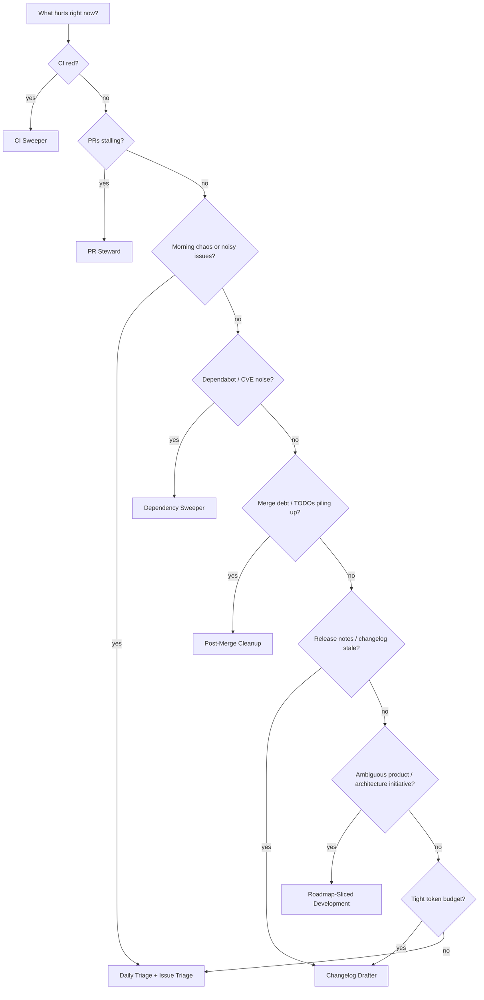

# Which Pattern When?

Pick one primary loop per concern. Overlapping loops need coordination — see [multi-loop.md](./multi-loop.md).



## Cost-aware picks

Estimate before you schedule:

```bash
npx @jununfly/zj-loop-cost --pattern <id> --level L1
npx @jununfly/zj-loop-init . --pattern daily-triage --tool grok   # scaffolds zj-loop-budget.md + zj-loop-run-log.md
```

| Situation | Prefer | Avoid (until budget + early-exit) |
|-----------|--------|-----------------------------------|
| Hobby / tight plan | Changelog Drafter, Daily Triage (L1), Post-Merge | CI Sweeper at 5m, PR Steward at 5m |
| Active CI fires | CI Sweeper at **15m+** with early-exit | Full triage every 5m when main is green |
| Many open PRs | PR Steward at 10–15m, L1 watch first | L2 fix loops on every tick |
| Release week | Changelog Drafter daily | Dependency Sweeper + CI Sweeper unattended |

`zj-loop-audit` caps **L3** until `zj-loop/zj-loop-budget.md`, `zj-loop/zj-loop-run-log.md`, and a `zj-loop/ZJ-LOOP.md` budget section exist.

## Pattern families

Use families first, then pick the concrete pattern:

| Family | Use when | Patterns |
|--------|----------|----------|
| Attention / backlog loops | You need a regular view of what deserves attention, without auto-fixing by default. | [Daily Triage](../patterns/daily-triage.md), [Issue Triage](../patterns/issue-triage.md) |
| Delivery unblockers | Delivery is blocked by PR state, failing checks, or dependency update pressure. | [PR Steward](../patterns/pr-steward.md), [CI Sweeper](../patterns/ci-sweeper.md), [Dependency Sweeper](../patterns/dependency-sweeper.md) |
| Hygiene / release loops | The repo needs cleanup after merges or release notes before publishing. | [Post-Merge Cleanup](../patterns/post-merge-cleanup.md), [Changelog Drafter](../patterns/changelog-drafter.md) |
| Roadmap initiative execution | The work is an ambiguous initiative that needs branch, slice, evidence, and PR discipline. | [Roadmap-Sliced Development](../patterns/roadmap-sliced-development.md) |

## Quick reference

| Symptom | Pattern | Start with |
|---------|---------|------------|
| CI failing on main or PRs | [CI Sweeper](../patterns/ci-sweeper.md) | L2, 15m cadence, max 3 attempts |
| PRs waiting on review/CI/rebase | [PR Steward](../patterns/pr-steward.md) | L1 watch → L2 assisted |
| "What should I work on?" every morning or noisy GitHub issues | [Daily Triage](../patterns/daily-triage.md) + [Issue Triage](../patterns/issue-triage.md) (new) | **L1 report-only week one** — low risk, excellent pair |
| Outdated packages / CVE alerts | [Dependency Sweeper](../patterns/dependency-sweeper.md) | L2 patch-only, denylist majors |
| TODOs and cleanup after merges | [Post-Merge Cleanup](../patterns/post-merge-cleanup.md) | L1 off-peak, small fixes only |
| Stale or missing release notes | [Changelog Drafter](../patterns/changelog-drafter.md) | **L1** (draft only first), very low risk |
| Ambiguous product, architecture, docs, or release initiative | [Roadmap-Sliced Development](../patterns/roadmap-sliced-development.md) | **L2 guided** — one branch, one slice at a time, explicit closeout + PR handoff |

## Overlap rules

| Combination | Rule |
|-------------|------|
| CI Sweeper + PR Steward | CI Sweeper owns failing checks; PR Steward does not re-fix the same branch in the same hour |
| Daily Triage + anything | Daily Triage reports; action loops execute. Triage does not auto-fix in L1 |
| Dependency Sweeper + CI Sweeper | Pause Dependency Sweeper while CI is red on main |
| Post-Merge + PR Steward | Post-Merge runs off-peak only |
| Changelog Drafter + anything | Changelog Drafter is read-mostly and safe to run alongside others; it should not auto-publish |
| Roadmap-Sliced Development + anything | Roadmap-Sliced owns the bounded initiative branch; scheduled loops report or feed issues but do not expand its PR without a Human Gate |

## First loop recommendation

If unsure, start with **Daily Triage at L1**. It teaches state discipline without auto-merge risk.

```bash
npx @jununfly/zj-loop-init . --pattern daily-triage --tool grok
npx @jununfly/zj-loop-audit . --suggest
```
