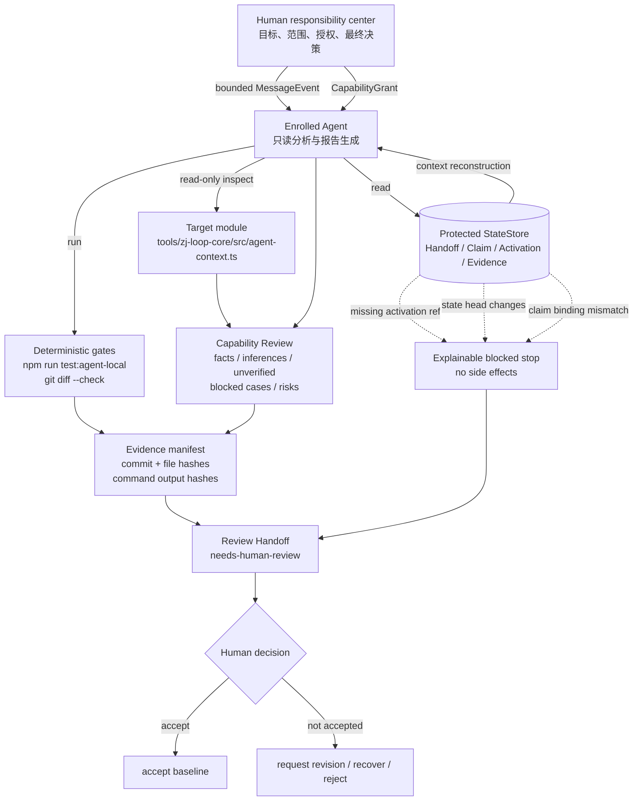

# Single-Agent OPN Atom Baseline

这份视图把机器可校验的 `agent-context-capability-review.v1` 报告翻译成 Human 可快速审查的流程图。

## Human Readout

- **Human** 是责任中心，负责目标、边界、授权和最终决策。
- **Agent** 是被委托执行节点，负责只读分析、运行确定性 gate 和生成报告。
- **StateStore** 提供受保护的 handoff、claim、activation 和 evidence 事实。
- **Evidence manifest** 将源码、测试、命令输出和 pinned commit 绑定起来。
- **Review Handoff** 把结论交回 Human；Agent 不得自我接受报告。
- 缺少 activation ref、state head 不稳定或 claim 绑定冲突时，系统解释性停止，且不执行副作用。

## Scope Boundary

这份 baseline 不证明：双 Agent 组网、Directed Task Graph、跨设备 Relay、资源隔离编排或 Workbuddy 集成。它只证明一个 Human 委托一个独立 Agent 的可审查 Loop Atom。

机器报告：[agent-context-capability-review.json](./agent-context-capability-review.json)
